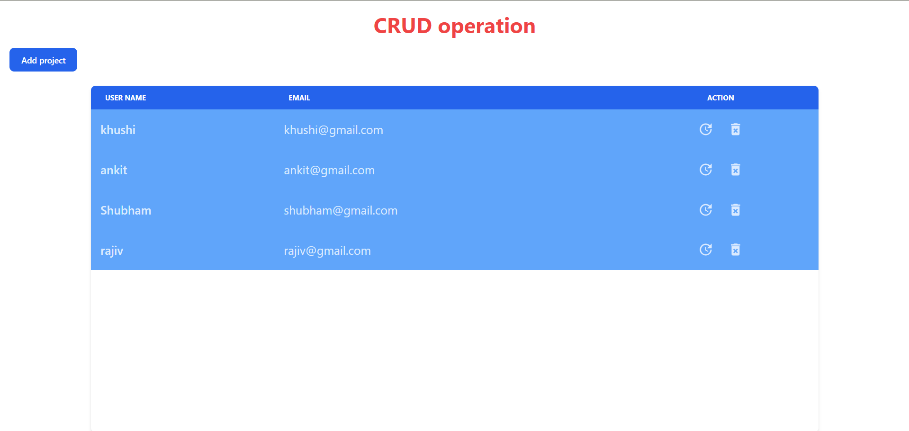
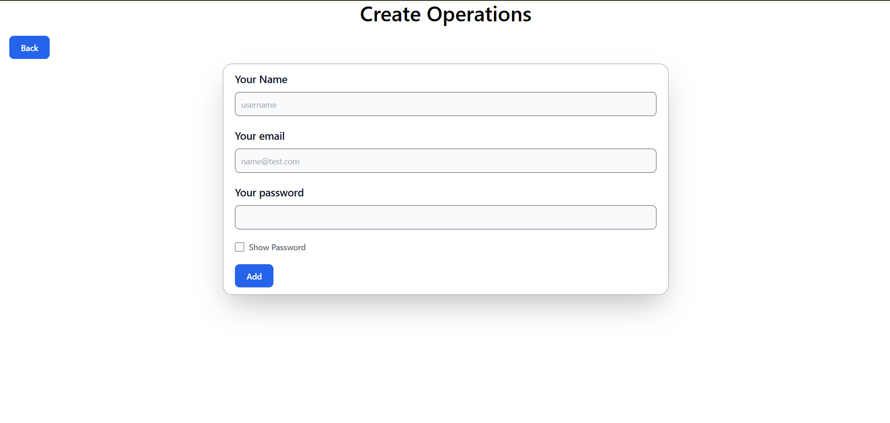
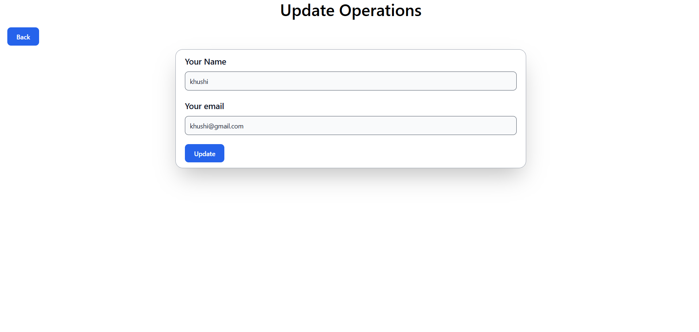

<h1 align="center">MERN Crud Operation</h1>

In these Project I have made the CRUD operation in mern stack where the user can create read update and delete with notification faculty and uses the Tailwindcss for desiging and Backend is created using the express JS for backend framework and nodejs as server.

<h1 align="center">Technologies Used</h1>

<h3>Client-Side Dependencies</h3>
axios
react
react-dom
react-hook-form
react-hot-toast
react-icons
react-router-dom
tailwindcss

<h3>Server-Side Dependencies</h3>
bcryptjs
cors
dotenv
express
joi
mongoose

<h1 align="center">Project Images</h1>

Read and Delete operation

Create operation

Update operation

